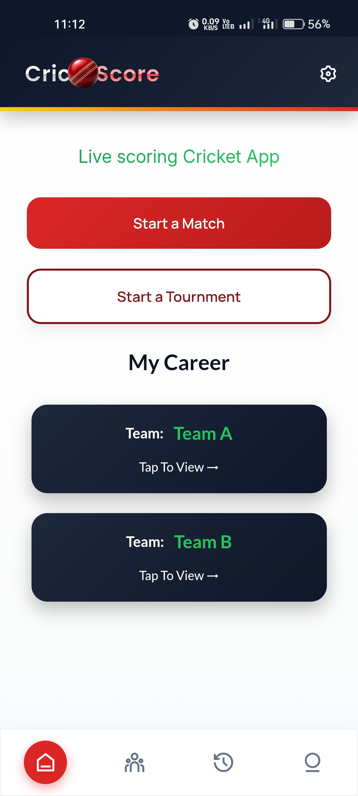
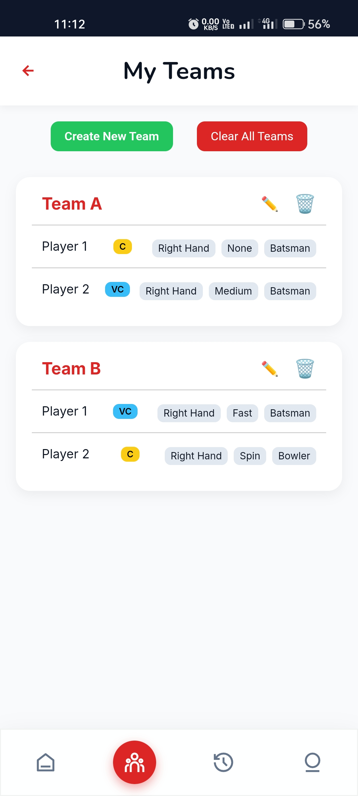
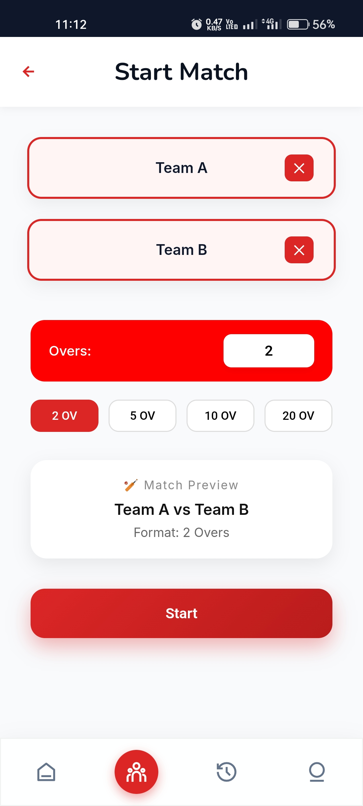
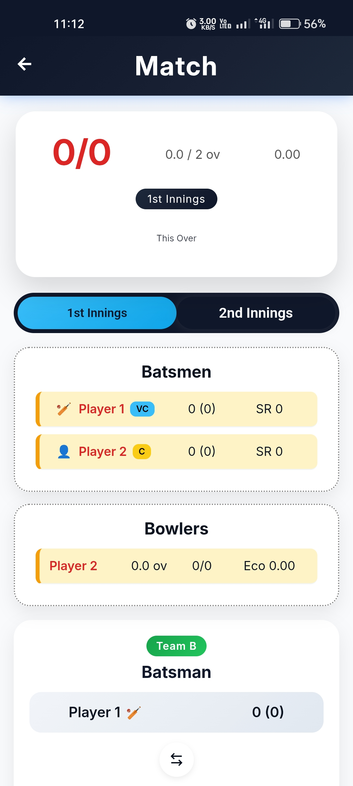
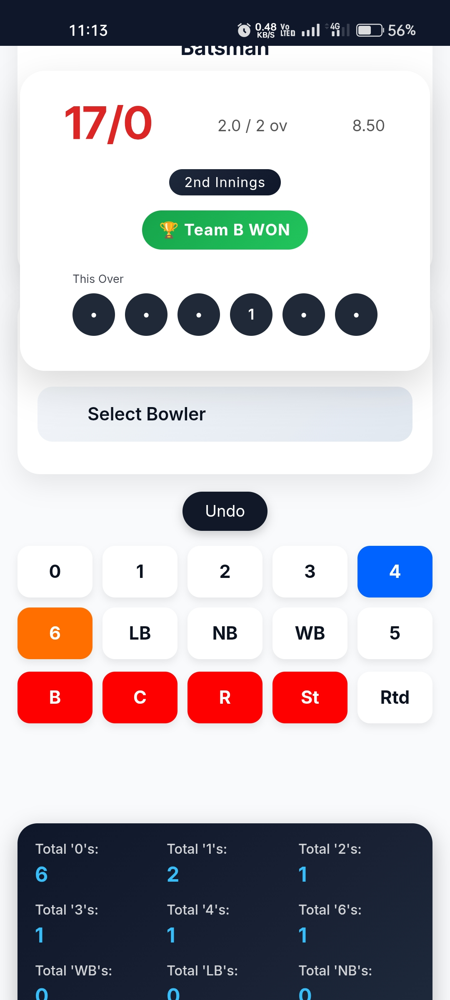
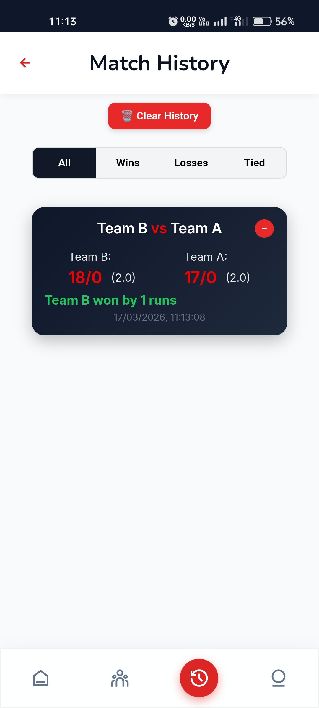

🏏 CricScore App

📌 Overview

CricScore is a mobile application designed to manage and update live cricket match scores efficiently. The app focuses on dynamic data handling where a single input updates multiple match statistics in real-time.

🚀 Features

- Live cricket score tracking
- Dynamic update of multiple match statistics
- Efficient data handling and structured logic
- User-friendly interface for smooth interaction
- Real-time consistency in score updates

🛠️ Tech Stack

- Java / Kotlin (update based on what you used)
- Android Studio
- [Firebase / SQLite / Backend – add if used]

⚙️ How It Works

- User inputs match events (runs, wickets, overs)
- Application processes input and updates multiple statistics
- Ensures real-time consistency across score, strike rate, and match data

📸 Screenshots

Home Screen

Teams Screen

Start Screen

Score Update Screen

Match End Screen

History Screen

Profile Screen 

📦 APK Download

https://github.com/kranthi-07/CricScore/blob/main/app/release/app-release.apk

💻 GitHub Repository

https://github.com/kranthi-07/CricScore

📂 Project Structure

- "app/" – Main application code
- "gradle/" – Build configuration
- "build.gradle.kts" – Project dependencies

🎯 Future Improvements

- Add user authentication
- Cloud database integration
- Enhanced UI/UX design
- Live match API integration

👨‍💻 Author

Kranthi Kumar

- LinkedIn: https://www.linkedin.com/in/kranthi-vennapusa-767200286
- GitHub: https://github.com/kranthi-07
